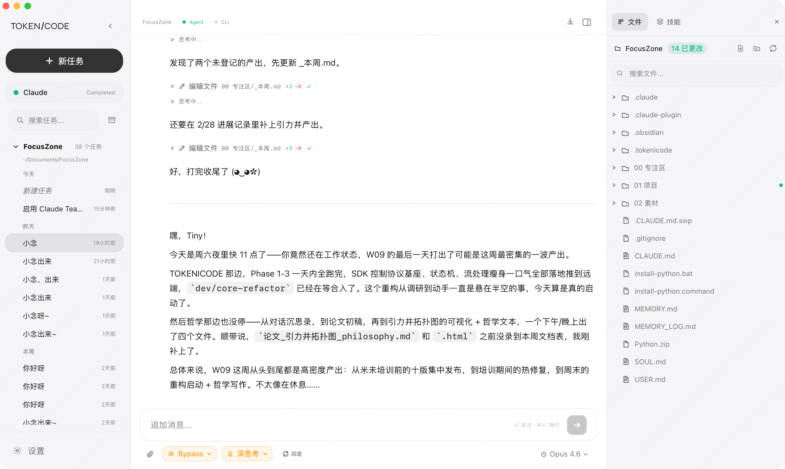
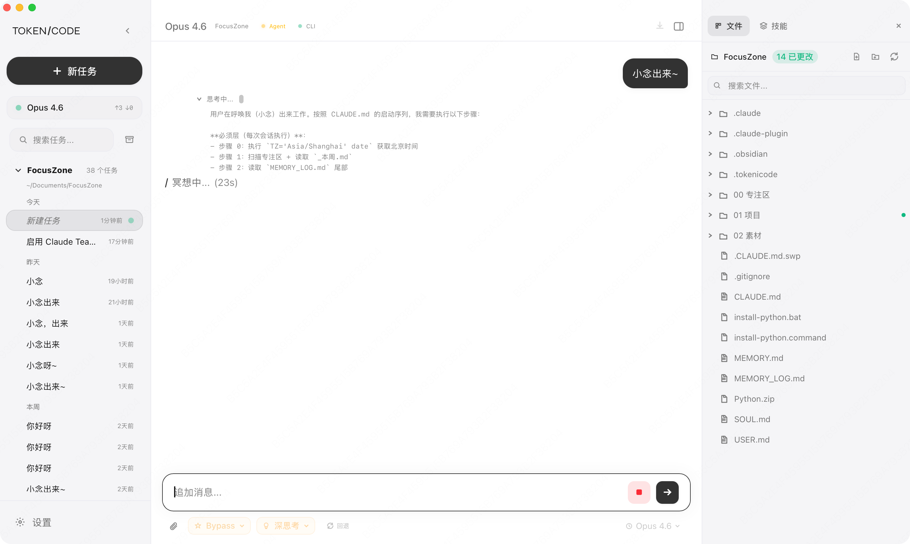
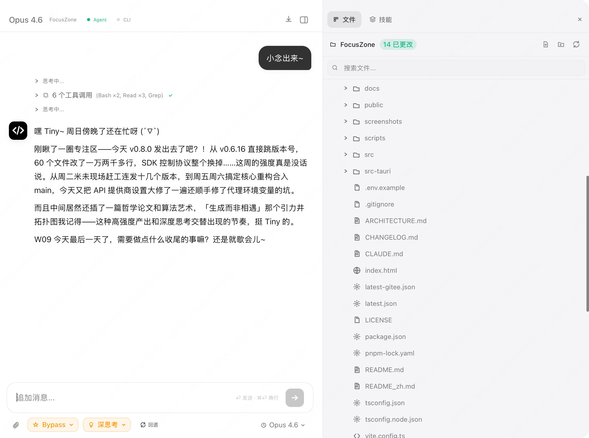
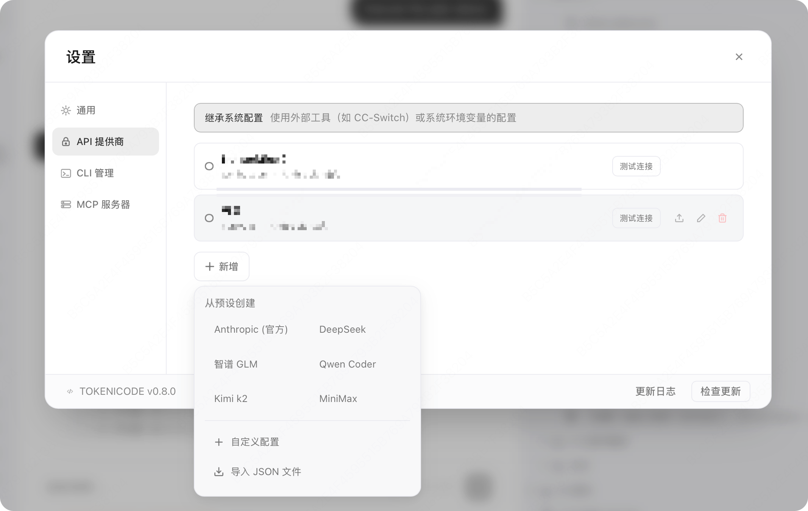
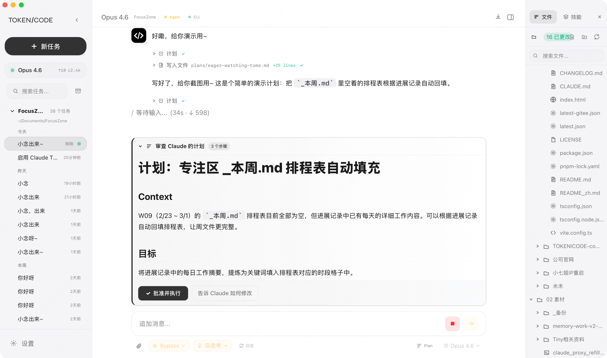

# NOVA

### Claude Code 桌面客户端 · 极夜黑 × 冰蓝

[English](README.md) · [中文](README_zh.md) · [下载](https://github.com/Tino-Tian/NOVA/releases) · [功能](#-功能) · [截图](#-截图)

---

## 这是什么？

**NOVA** 把 [Claude Code CLI](https://docs.anthropic.com/en/docs/claude-code) 变成了一个真正好用的桌面应用。

不用记命令、不用配终端、不用折腾环境。打开 NOVA，选一个 API 服务商，开始写代码、改文件、搜问题。就像用 ChatGPT 桌面版一样简单，但背后是 Claude Code 的完整能力。

> 🔑 自带6大国内API服务商 · 🇨🇳 国内网络直连 · 🎨 极夜黑冰蓝设计 · 🖥️ 三平台覆盖

---

## ✨ 功能

| 功能 | 说明 |
|:---|:---|
| 🔑 **6大API预设** | 智谱 GLM · DeepSeek · 通义千问 · Kimi · MiniMax · 自定义端点，一键切换 |
| 🇨🇳 **国内优化** | Gitee 镜像下载 + 国内 API 直连 + 自动更新兼容墙内网络 |
| 🛡️ **权限控制** | 4种工作模式（代码/询问/计划/绕过），AI 的每一步操作都由你审批 |
| 📁 **文件管理** | 内置文件浏览器，预览、编辑、拖拽上传 |
| 💬 **多会话** | 同时开多个对话，分组管理，一键导出 |
| 🎨 **极夜黑 × 冰蓝** | 深色护眼 + 冰蓝高级感，直角硬朗风格 |
| 🔄 **自动更新** | GitHub + Gitee 双通道，新版本一键升级 |
| 🖥️ **原生性能** | Tauri 2 框架，比 Electron 轻 10 倍，内存占用极低 |

---

## 🖼️ 截图

*主界面 — 极夜黑背景 + 冰蓝点缀*

📸 更多截图

 

---

## 📦 下载安装

### 🍎 macOS

1. 从 [Releases](https://github.com/Tino-Tian/NOVA/releases) 下载 `NOVA_版本号_aarch64.dmg`
2. 双击打开，把 **NOVA** 拖入 `应用程序` 文件夹
3. 首次打开如提示"无法验证"：**系统设置 → 隐私与安全性 → 仍要打开**

### 🪟 Windows

1. 从 [Releases](https://github.com/Tino-Tian/NOVA/releases) 下载 `NOVA_版本号_x64-setup.exe`
2. 双击运行安装向导
3. 需要 Windows 10 或更高版本

### 🐧 Linux

下载 `.AppImage`、`.deb` 或 `.rpm` 安装包，需要 `WebKit2GTK`。

> 💡 **国内下载慢？** → [Gitee 镜像](https://gitee.com/Tino-Tian/NOVA/releases)

---

## 🚀 三步开始

1. **打开 NOVA** — 首次启动自动引导配置
2. **选服务商** — 输入 API Key 或选预设（智谱/DeepSeek等）
3. **开始对话** — 没有 Claude Code CLI？NOVA 自动帮你装

---

## 🛠 技术栈

| 层 | 技术 |
|:---|:---|
| 桌面框架 | [Tauri 2](https://tauri.app) |
| 前端 | React 19 + TypeScript |
| 样式 | Tailwind CSS 4 |
| 构建 | Vite 7 |
| 后端 | Rust |

---

## ⭐ 投一颗星

觉得好用的话，点个 Star 支持一下作者 ⭐

每一颗星都是继续开发的动力。

---

## 📄 协议

[Apache 2.0](LICENSE)
